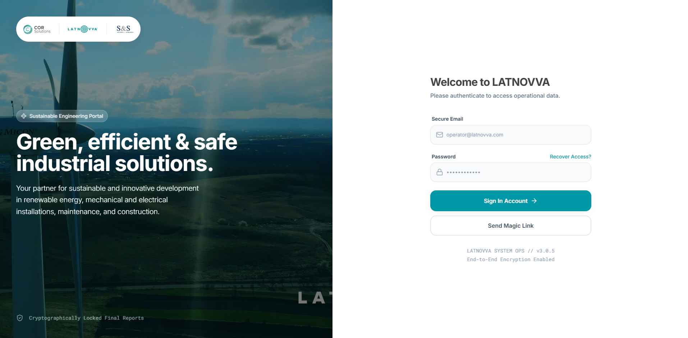
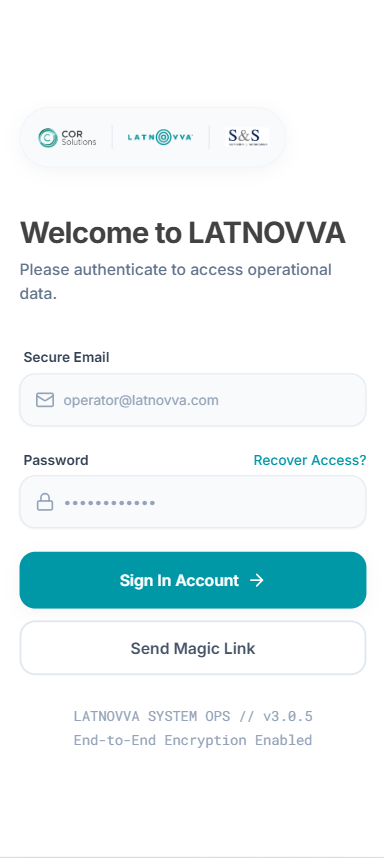
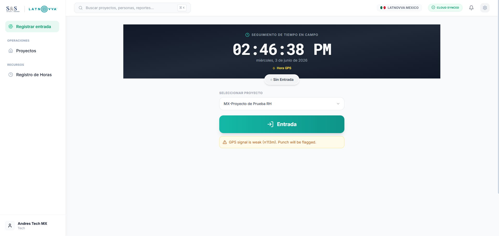
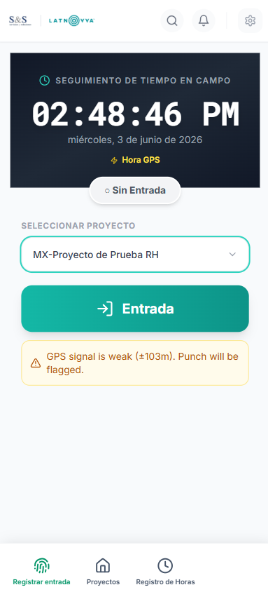
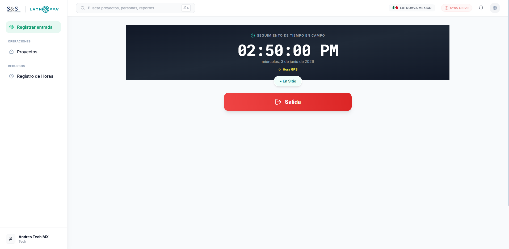
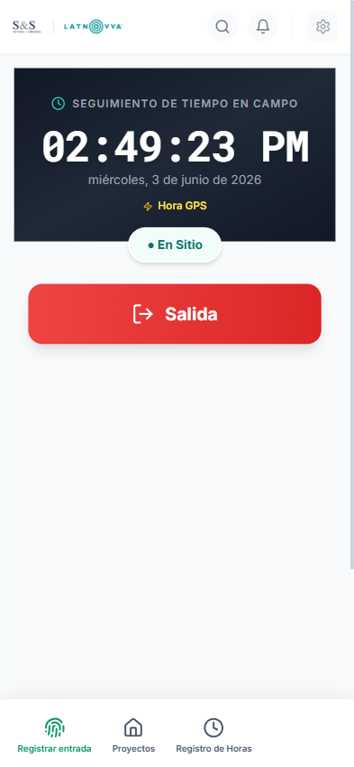
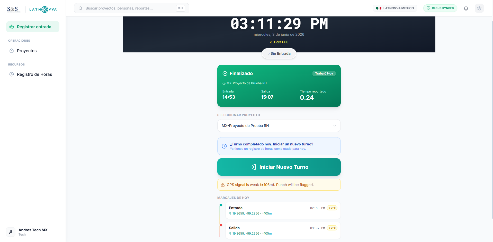
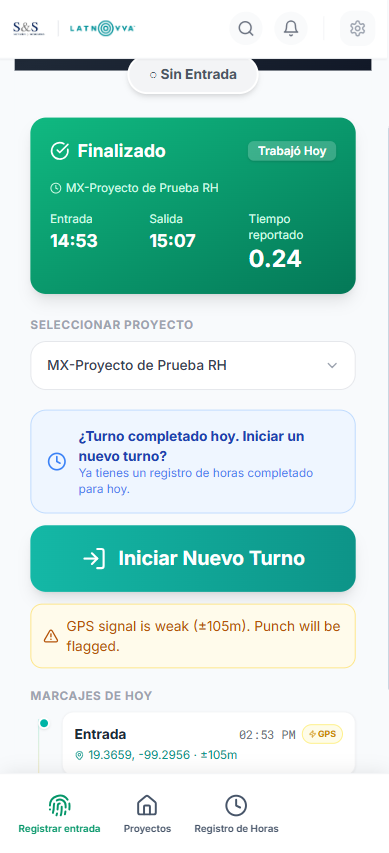

# Manual de Usuario: Registro de Asistencia (Clock In / Clock Out)
## Portal LATNOVVA ServiceTool (Roles de Oficina)

Este manual te guiará paso a paso para utilizar el sistema de registro de entrada y salida de **LATNOVVA ServiceTool**. Al ser un usuario de oficina, utilizarás la interfaz en su modalidad más sencilla y ágil.

---

## 📱 ¿Qué es la PWA y cómo instalarla?

La plataforma está desarrollada como una **PWA (Aplicación Web Progresiva)**. Esto significa que no necesitas descargarla desde una tienda de aplicaciones convencional (App Store o Play Store), pero puedes instalarla directamente en tu computadora o celular para usarla como una aplicación nativa.

### Ventajas de la PWA:
- **Acceso rápido:** Tendrás un ícono de acceso directo en tu escritorio o pantalla de inicio del celular.
- **Funcionamiento sin internet (Modo Offline):** Si pierdes la conexión, podrás seguir registrando tu entrada o salida. El sistema guardará la marca localmente de forma segura y la sincronizará automáticamente con el servidor una vez que vuelvas a tener señal.

### Cómo instalarla:
- **En Computadora (Chrome / Edge):** Entra al portal desde el navegador. En el lado derecho de la barra de direcciones (URL), aparecerá un ícono con una pantalla y una flecha hacia abajo (o tres puntos -> *Instalar LATNOVVA ServiceTool*). Haz clic en él y selecciona **Instalar**.
- **En Celular (Android / Chrome):** Al entrar al sitio, aparecerá un banner inferior que dice *"Agregar LATNOVVA ServiceTool a la pantalla de inicio"*. Tócalo para instalar.
- **En Celular (iPhone / Safari):** Abre el sitio en Safari, presiona el botón de **Compartir** (el cuadro con la flecha hacia arriba) y selecciona la opción **"Agregar al inicio"**.

---

## 🔑 Paso 1: Inicio de Sesión (Login)

Accede al sitio web de **LATNOVVA MX** desde tu computadora o celular.

> [!NOTE]
> **Tus credenciales de acceso:** Tu correo seguro de usuario y contraseña temporal te serán compartidos a través de un **correo electrónico por separado**. En tu primer ingreso, podrás utilizar estas credenciales.

### ¿Qué verás y qué puedes modificar?
- **Correo Seguro (Secure Email):** Escribe el correo electrónico institucional que te fue proporcionado.
- **Contraseña (Password):** Escribe tu contraseña segura.
- **Botón Iniciar Sesión (Sign In Account):** Presiónalo para ingresar al sistema.
- **Enviar Enlace Mágico (Send Magic Link):** Si prefieres un acceso rápido sin ingresar contraseña, escribe tu correo y presiona este botón. Recibirás un enlace único en tu correo para iniciar sesión de inmediato con un solo clic.

````carousel

<!-- slide -->

````

---

## 📍 Paso 2: Pantalla de Marcaje de Entrada (Clock In)

Una vez iniciada la sesión, el sistema te dirigirá al módulo de **Registro de Entrada / Salida**. 

### ¿Qué verás en esta pantalla?
- **Reloj Digital:** Un reloj grande en la parte superior sincronizado con la hora del servidor y del satélite GPS.
- **Estatus de Registro:** Verás un chip con el texto **"○ Sin Entrada"** en color gris, indicando que aún no has registrado tu ingreso de hoy.
- **Insignia GPS:** Indica el estado de la geolocalización. Verás en color verde **"GPS ±[precisión]m"** cuando el sistema haya bloqueado tu ubicación actual.
- **Origen de la Hora:** Muestra si el sistema está tomando la hora satelital (**Hora GPS** en amarillo) o la hora de tu dispositivo.

### ¿Qué debes cambiar o seleccionar?
1. **Seleccionar Proyecto:** Es obligatorio hacer clic en el menú desplegable y elegir el proyecto o la oficina en la que laborarás hoy (por ejemplo: *Oficina Central*). **No podrás presionar el botón de entrada si este campo está vacío.**
2. **Permisos de Ubicación:** Asegúrate de aceptar el permiso de geolocalización que solicita tu navegador.

### Acción:
- Presiona el botón verde grande **"Entrada"** para iniciar tu jornada laboral.
- *Nota en caso de contingencia:* Si por alguna razón no tienes señal GPS (insignia en rojo), el sistema te habilitará el botón de **Entrada Manual** (en color ámbar). Al presionarlo, deberás especificar el motivo o justificación de la marca para que tu supervisor la valide más tarde.

````carousel

<!-- slide -->

````

---

## 🟢 Paso 3: Turno Activo (Clocked In)

Al registrar tu entrada con éxito, la pantalla se actualizará para reflejar que te encuentras trabajando.

### ¿Qué verás en esta pantalla?
- **Estatus de Registro:** El chip superior cambiará a **"● En Sitio"** en color verde turquesa, confirmando que tu turno está corriendo.
- **Cambio de Botón Principal:** El botón verde de entrada desaparecerá y en su lugar verás un botón rojo grande de **"Salida"**.
- Puedes cerrar el navegador o la aplicación PWA con total tranquilidad; tu turno continuará activo en el sistema.

````carousel

<!-- slide -->

````

---

## 🔴 Paso 4: Marcaje de Salida y Resumen (Clock Out)

Al finalizar tu horario laboral de oficina, ingresa nuevamente al portal o abre la PWA instalada en tu dispositivo.

### Acción:
1. Revisa que tu estatus siga marcando **"● En Sitio"**.
2. Presiona el botón rojo grande **"Salida"** para dar por terminada tu jornada laboral.

### ¿Qué verás al marcar Salida? (Resumen de Jornada)
Una vez que presionas el botón, el sistema te mostrará una pantalla de confirmación con los siguientes elementos:

- **Estatus Finalizado:** El chip de estatus cambiará a **"✓ Finalizado"** o **"Trabajó Hoy"** en verde.
- **Tarjeta Verde de Resumen (Summary):** Una sección en color verde esmeralda que detalla de forma clara:
  - El **nombre del proyecto/oficina** en el que laboraste.
  - La **hora exacta de entrada** (Time In).
  - La **hora exacta de salida** (Time Out).
  - Las **horas totales laboradas** en el día (ej. `8.00` hrs).
- **Línea de Tiempo (Marcajes de Hoy):** En la parte inferior, verás un desglose gráfico de tus marcas. Al hacer clic sobre los enlaces de coordenadas, abrirá automáticamente Google Maps para mostrarte el punto geográfico exacto desde donde realizaste tus marcas de Entrada y Salida.

````carousel

<!-- slide -->

````

---

## 💡 Preguntas Frecuentes y Consejos (FAQ)

> [!TIP]
> **1. Olvidé marcar mi entrada o salida a tiempo. ¿Qué hago?**
> Ponte en contacto con tu supervisor administrativo. Él o ella podrá corregir tus horas directamente en el panel de **Timesheets** (hojas de asistencia). Cabe señalar que, si por olvido dejas tu turno abierto, **el sistema se cerrará automáticamente después de exceder las 14 horas de jornada activa**.
> 
> **2. ¿La aplicación consume mis datos todo el tiempo?**
> No. La aplicación de marcaje de tiempo solo utiliza internet y GPS por una fracción de segundo al momento de presionar los botones de **Entrada** o **Salida**.
> 
> **3. ¿Por qué me aparece "GPS Débil" o "Buscando GPS"?**
> Si estás en un sótano o en un edificio con paredes muy gruesas, tu señal GPS puede ser baja. Intenta acercarte a una ventana o salir al exterior un momento para agilizar la detección y asegurar un marcaje preciso.
